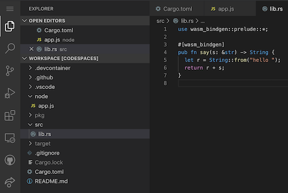
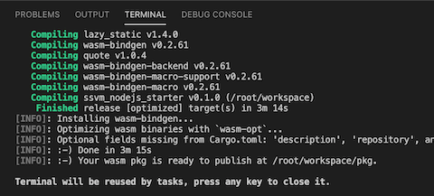
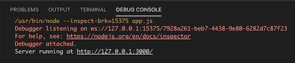

# Getting started


[Fork this project](https://github.com/second-state/ssvm-nodejs-starter/fork) to create your own Rust functions in Node.js. [Learn more](https://www.secondstate.io/articles/getting-started-rust-nodejs-vscode/)

* The Rust functions are in the `src` directory. You can put high performance workload into Rust functions.
* The JavaScript functions are in the `node` directory and they can access the Rust functions.
* Use the `node node/app.js` command to run the application in Node.js.


## Use Docker to build and run

```
$ docker pull secondstate/ssvm-nodejs-starter:v1
$ docker run -p 3000:3000 --rm -it -v $(pwd):/app secondstate/ssvm-nodejs-starter:v1
(docker) # cd /app
(docker) # ssvmup build
(docker) # node node/app.js
```

From a second terminal window, you can test the local server.

```
$ curl http://localhost:3000/?name=SSVM
hello SSVM
```


## Use VSCode Codespace

<p>
    <a href="https://online.visualstudio.com/environments/new?name=Rust%20and%20WebAssembly%20in%20Node.js&repo=second-state/ssvm-nodejs-starter">
        
    </a>
</p>


This project template works with the VS Codespaces online IDE! Code, build, and run directly from inside the browser. No software download or install needed! Check out the [high-res screencast](https://youtu.be/j85cbNsciOs).

> VS Codespaces runs entirely in your browser and costs around $1 per work day. It is cheaper than a cup of coffee in the office. Alternatively, use locally installed VSCode and Docker, and [launch the IDE with your remote git repository](https://code.visualstudio.com/remote-tutorials/containers/getting-started).

1 First, open the [VS Codespaces](https://online.visualstudio.com/) web site and login with your Azure account. You can get a [free Azure account](https://azure.microsoft.com/en-us/free/).

2 Next, create a new Codespace. Put your forked repository into the Git Repository field.


3 Then open the `src/lib.rs`, `node/app.js` and `Cargo.toml` files and see how the Node.js express app calls the Rust function to say hello.



4 Click on the Run button on the left panel, and then the Launch Program at the top to build and run the application.


The Terminal window at the bottom shows the build progress. It builds the Rust program, and then launches the Node.js app.



The Debug window shows the Node.js server running and waiting for web requests.



5 Now, you have two choices. You could use the proxy link for `127.0.0.1:3000` to access the running server in a browser.


Or, you could open another terminal window in the IDE via the `Terminal -> New Terminal` menu.


From the terminal window, you can test the local server.

```
$ curl http://127.0.0.1:3000/?name=SSVM
hello SSVM
```

### More exercises

Now, you can copy and paste code from [this project](https://github.com/second-state/wasm-learning/tree/master/nodejs/functions).

* `src/lib.rs` --> Replace with [code here](https://github.com/second-state/wasm-learning/blob/master/nodejs/functions/src/lib.rs)
* `Cargo.toml` --> Replace with [code here](https://github.com/second-state/wasm-learning/blob/master/nodejs/functions/Cargo.toml)
* `node/app.js` --> Replace with [code here](https://github.com/second-state/wasm-learning/blob/master/nodejs/functions/node/app.js)

Click on Run to see the build output in Terminal window, and application console output in Debug window.

Try to log into GitHub from the IDE, and use the IDE's GitHub integration features to commit the changes, push the changes back into your forked repository, and perhaps even send us a Pull Request from the IDE!

## Read more:

* [The Case for WebAssembly on the Server-side](https://www.secondstate.io/articles/why-webassembly-server/)
* [Guide on how to Rust and WebAssembly for server-side apps](https://www.secondstate.io/articles/getting-started-with-rust-function/)

## Resources

* [The Second State VM (SSVM)](https://github.com/second-state/ssvm) is a high performance [WebAssembly virtual machine](https://www.secondstate.io/ssvm/) designed for server-side applications.
* [The SSVM NPM addon](https://github.com/second-state/ssvm-napi) provides access to the SSVM, and programs in it, through a Node.js host application.
* [The SSVM ready tool, ssvmup](https://github.com/second-state/ssvmup) is a [toolchain](https://www.secondstate.io/articles/ssvmup/) for compiling Rust programs into WebAssembly, and then make them accessible from JavaScripts via the SSVM.

Brought to you by the Open source dev team at [Second State](https://www.secondstate.io/). Follow us on [Twitter](https://twitter.com/secondstateinc), [Facebook](https://www.facebook.com/SecondState.io/), [LinkedIn](https://www.linkedin.com/company/second-state/), [YouTube](https://www.youtube.com/channel/UCePMT5duHcIbJlwJRSOPDMQ), or [Medium](https://medium.com/wasm)

