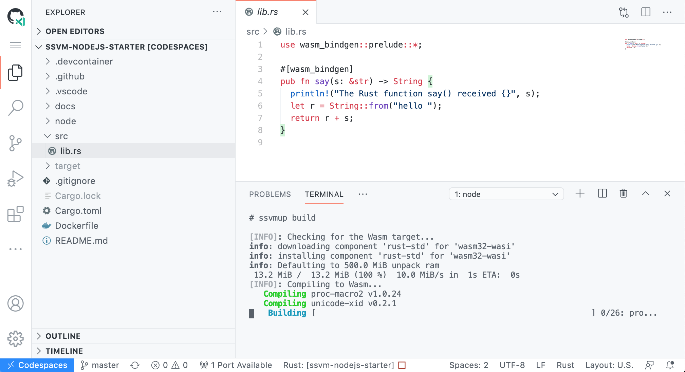

# Getting started


[Fork this project](https://github.com/second-state/wasmedge-nodejs-starter/fork) to create your own Rust functions as a web service.

## How it works

* The Rust function source code is in the `src/lib.rs` file.
* Use the [rustwasmc tool](https://www.secondstate.io/articles/rustwasmc/) to compile the Rust function into a WebAssembly module in the `pkg` directory.
* Optional: Use the `node node/app.js` command to test the function locally in Node.js.
* Upload the `pkg/*.wasm` file to the [Second State FaaS service](https://www.secondstate.io/articles/getting-started-with-function-as-a-service-in-rust/), OR to a [Node.js server](https://www.secondstate.io/articles/getting-started-with-rust-function/), to turn it into a web service.

This is the Github Codespaces edition. Check out the [Docker edition here](README.md).

## Github Codespaces



Click on the Code -> Open with Codespaces menu, and wait for the Codespaces IDE screen to build and come up. This could take a few minutes as it installs all the dependencies Rust and WebAssembly requires.

Open the `src/lib.rs` and `Cargo.toml` files to learn about the Rust function. 

Open the Terminal window via the `Terminal -> New Terminal` menu, and run the command and wait until it completes building.

```
$ rustwasmc build
```

### Option 1: Upload to the FaaS and test

Run the following command in the terminal window. Upload the wasm file in the pkg folder to the FaaS. Double check the .wasm file name before you upload.

```
$ curl --location --request POST 'https://rpc.ssvm.secondstate.io:8081/api/executables' \
--header 'Content-Type: application/octet-stream' \
--header 'SSVM-Description: say hello' \
--data-binary '@pkg/hello_lib_bg.wasm'
```

The FaaS returns

```
{"wasm_id":161,"wasm_sha256":"0xfb413547a8aba56d0349603a7989e269f3846245e51804932b3e02bc0be4b665","usage_key":"00000000-0000-0000-0000-000000000000","admin_key":"00xxxxxx-xxxx-xxxx-xxxx-4adc960fd2b8"}
```

Make a function call via the web.

```
(docker) # curl --location --request POST 'https://rpc.ssvm.secondstate.io:8081/api/run/161/say' \
--header 'Content-Type: text/plain' \
--data-raw 'Second State FaaS'
hello Second State FaaS
```

You can easily incorporate this web service into your HTML web pages. [See how](https://www.secondstate.io/articles/getting-started-with-function-as-a-service-in-rust/#web-ui)


### Option 2: Local test and debug

From the terminal window, start the Node.js application.

```
(docker) # node node/app.js
```

Create a second terminal window, you can test the local server.

```
$ curl http://localhost:3000/?name=WasmEdge
hello WasmEdge
```

## More exercises

Now, you can copy and paste code from [this project](https://github.com/second-state/wasm-learning/tree/master/nodejs/functions).

* `src/lib.rs` --> Replace with [code here](https://github.com/second-state/wasm-learning/blob/master/nodejs/functions/src/lib.rs)
* `Cargo.toml` --> Replace with [code here](https://github.com/second-state/wasm-learning/blob/master/nodejs/functions/Cargo.toml)
* `node/app.js` --> Replace with [code here](https://github.com/second-state/wasm-learning/blob/master/nodejs/functions/node/app.js)

Build, deploy, test. You can find many more examples to play with here:

* FaaS deployment: https://github.com/second-state/wasm-learning/tree/master/faas
* Node.js deployment: https://github.com/second-state/wasm-learning/tree/master/nodejs

## Read more:

* [Tutorials for FaaS](https://www.secondstate.io/faas/)
  * [Getting started with FaaS in Rust](https://www.secondstate.io/articles/getting-started-with-function-as-a-service-in-rust/)
  * [Use Binary Data as Function Input and Output](https://www.secondstate.io/articles/use-binary-data-as-function-input-and-output/)
  * [Mixing Text and Binary Data in Call Arguments](https://www.secondstate.io/articles/mixing-text-and-binary-data-in-call-arguments/)
  * [Internet of Functions: webhooks](https://www.secondstate.io/articles/internet-of-functions-webhooks/)
  * [AI as A Service on WebAssembly](https://www.secondstate.io/articles/ai-as-a-servide-on-webaasembly/)
* [Tutorials for Node.js micro-services](https://www.secondstate.io/ssvm/)
  * [The Case for WebAssembly on the Server-side](https://www.secondstate.io/articles/why-webassembly-server/)
  * [Getting started on Rust and WebAssembly for server-side apps](https://www.secondstate.io/articles/getting-started-with-rust-function/)
  * [Passing function arguments in JSON](https://www.secondstate.io/articles/rust-functions-in-nodejs/)
  * [Access operating system resources from WebAssembly (WASI)](https://www.secondstate.io/articles/wasi-access-system-resources/)
  * [Use Tensorflow and AI models from WebAssembly](https://www.secondstate.io/articles/face-detection-ai-as-a-service/)

## Resources

* [The WasmEdge Runtime](https://github.com/WasmEdge/WasmEdge) is a high performance WebAssembly virtual machine.
* [The rustwasmc](https://github.com/second-state/rustwasmc) is a [toolchain](https://www.secondstate.io/articles/ssvmup/) for compiling Rust programs into WebAssembly, and then make them accessible from JavaScripts via the WasmEdge Runtime.
* [The Second State FaaS](https://github.com/second-state/wasm-joey) is an open source FaaS engine based on WebAssembly and Node.js.

Brought to you by the Open source dev team at [Second State](https://www.secondstate.io/). Follow us on [Twitter](https://twitter.com/secondstateinc), [Facebook](https://www.facebook.com/SecondState.io/), [LinkedIn](https://www.linkedin.com/company/second-state/), [YouTube](https://www.youtube.com/channel/UCePMT5duHcIbJlwJRSOPDMQ), or [Medium](https://medium.com/wasm)

